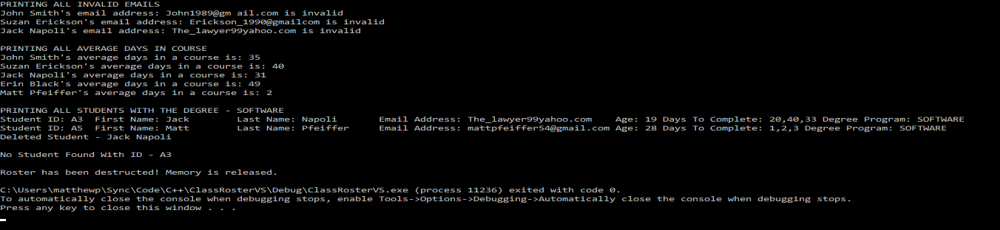

<h1> ClassRosterVS </h1> 

  <h2>Notable Concepts Involved:</h2>
  <ul>
    <li>Abstract Classes and Inheritance</li>
    <li>Pointers and Memory</li>
  </ul> 

  <h2>Program Flow:</h2>
  <ul>
    <li>Parses array of comma delimited student data.</li>
    <li>Creates a roster of students (seperating them based on their degree program).</li>
    <li>Prints out all students in the roster.</li>
    <li>Prints out any students with invalid emails.</li>
    <li>Prints out each students average days per course.</li>
    <li>Prints out all students with a software degree.</li>
    <li>Removed a student by their studentID (unique identifier).</li>
    <li>Attempts to remove the same student again (prints error message).</li>
    <li>Deletes the roster from memory.</li>
  </ul> 
    
  <kbd>
    
  </kbd>

